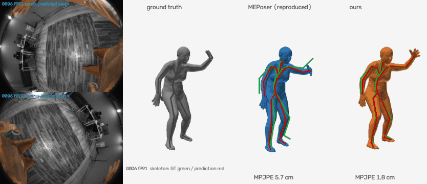
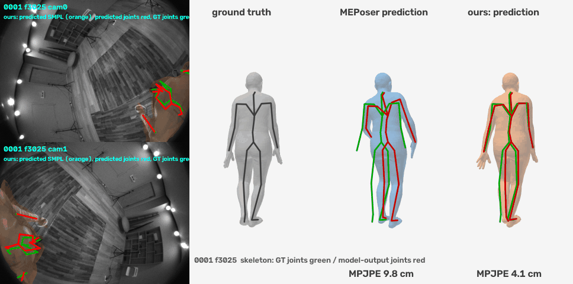
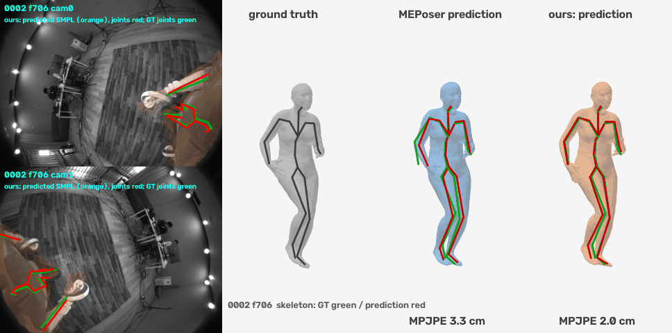
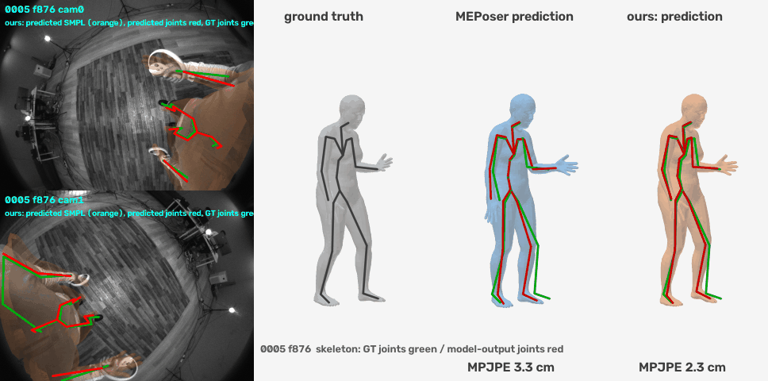
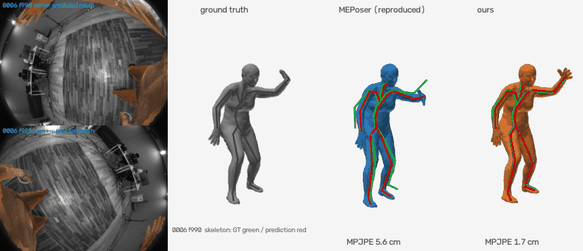
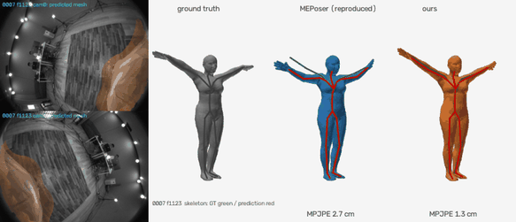
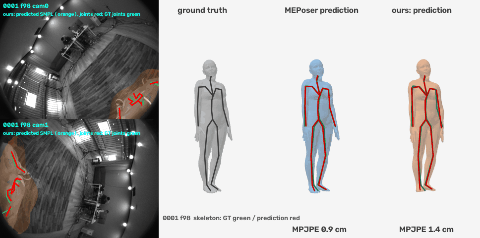
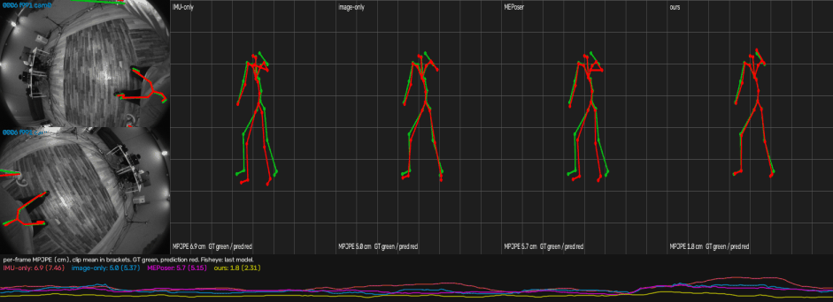

# MEPoser Reproduction: Egocentric Body Pose from Stereo Fisheye + IMUs

<a href="https://arxiv.org/abs/2408.17168"></a>
<a href="https://pico-ai-team.github.io/EMHI/"></a>
<a href="reports/REPORT.md"></a>
<a href="LICENSE"></a>

An independent, fully documented reproduction of **MEPoser**, the baseline of *EMHI: A Multimodal Egocentric Human
Motion Dataset with HMD and Body-Worn IMUs* (Fan et al., AAAI 2025), which the paper releases without code. The model
takes the two downward fisheye views of a VR headset plus five tracked devices (headset, two controllers, two leg
trackers) and predicts SMPL pose and shape. On top of the reproduction we add the geometry the paper leaves unused:
controller-driven wrist IK, a stereo reprojection fit through the calibrated fisheye model, and an adaptive lower-body crop.



*Held-out folder 0006, fast whole-body motion. Left: our predicted SMPL mesh projected into both headset fisheye views
through the calibrated fisheye model. Right: ground truth, reproduced MEPoser and ours; skeletons: ground truth green,
prediction red.*

## Highlights

- **The paper's claim reproduces.** Fusing images and IMUs beats either modality alone under 3-fold cross-validation.
- **Improvements: 3.53 → 1.96 cm MPJPE** on held-out recordings; an optional contact fit cuts
  foot skating from 17.7 to 10.2 cm/s for 0.03 cm of MPJPE.
- **The data is audited.** A per-folder audit ([DATA_AUDIT.md](reports/results/DATA_AUDIT.md)) found that the 10
  folders share one body shape (probably one person), that 0000 misses 30 % of its annotations, and that leg occlusion
  is essentially absent.
- **Everything is reproducible.** One script regenerates every number, and the metrics use the HMD-Poser code the paper compares against.
- **The dataset is not redistributed.** You prepare the data yourself; the figures show a few processed frames for illustration only.

## Installation

```bash
git clone https://github.com/CyberChickZ/meposer-repro.git && cd meposer-repro
python3 -m venv .venv && source .venv/bin/activate        # Python >= 3.11
pip install -e ".[dev]"                                   # exact tested versions: requirements.lock.txt
pytest -q                                                 # unit tests, no data needed, < 5 s
```

Tested with PyTorch 2.10 on Linux + CUDA (NVIDIA H200) and on macOS (Apple M4 Max). The device is chosen as
`cuda` > `mps` > `cpu`; add `--set device=cpu` to any command for a deterministic CPU run.

## Data preparation

**1. EMHI.** Obtain the data from the [EMHI authors](https://pico-ai-team.github.io/EMHI/); it is not included here.
This code was developed on a 10-folder subset (`0000`-`0009`, called subjects in the release) laid out as:

```
data/raw/<subject>/annots/*.npy            per-frame SMPL, 2D joints, extrinsics, device readings
data/raw/<subject>/camera/cam0/*.png       left fisheye, 640x480
data/raw/<subject>/camera/cam1/*.png       right fisheye
```

**2. SMPL.** Download `SMPL_NEUTRAL.pkl` from [smpl.is.tue.mpg.de](https://smpl.is.tue.mpg.de/) (registration
required) and convert it once, without `chumpy`:

```bash
python tools/convert_smpl_pkl.py /path/to/SMPL_NEUTRAL.pkl assets/smpl/SMPL_NEUTRAL.npz
```

**3. Preprocess.** This writes per-subject arrays, image memmaps and a dataset inspection report
(`data/processed/inspection/INSPECTION.md`). The fisheye calibration we fitted from the annotations ships in
`assets/calib/calib.json`; add `--recalibrate` to refit it from your data.

```bash
meposer prepare --raw data/raw --out data/processed                                  # 320x240, ~1 min
meposer prepare --raw data/raw --out data/processed_640 --image-size 640x480         # native, for the leg crops only
python scripts/data_audit.py                                                         # -> reports/results/DATA_AUDIT.md
```

Known issues in the 10-folder subset, from the audit: folder 0000 has annotations for only 1391 of its 1984 image
pairs, so it contributes almost nothing to temporal training (the loader prints a warning); all folders share one
SMPL body shape; `left_hand_acc` is a copy of `left_hand_pos` and is not used.

## Quick start with the released checkpoints

| file | content | size |
|---|---|---|
| `checkpoints/meposer_best.pt` | our temporal model (augmentation + foot-contact head, 40 epochs), fold holding out 0001 + 0006 | 44 MB |
| `checkpoints/stage1_image.pt` | MEPoser image branch of the same fold | 28 MB |
| `checkpoints/leg_roi.pt` | adaptive lower-body crop network of the same fold | 4 MB |

The checkpoints were trained without folders 0001 and 0006, so evaluate them only on those two.

```bash
# network output (the image-branch cache is rebuilt from stage1_image.pt on first use)
meposer evaluate --ckpt checkpoints/meposer_best.pt --split val

# + wrist IK + stereo 2D fit + 4 Hz low-pass
meposer evaluate --ckpt checkpoints/meposer_best.pt --split val --set refine_wrists=true refine_2d=true post_lowpass_hz=4

# + adaptive lower-body crop: leg peaks at native resolution, then the same evaluation on them
python scripts/leg_roi.py infer --weights checkpoints/leg_roi.pt --ckpt checkpoints/meposer_best.pt --out runs/leg_roi_release
meposer evaluate --ckpt checkpoints/meposer_best.pt --split val --set refine_wrists=true refine_2d=true post_lowpass_hz=4 \
    refine_2d_features=runs/leg_roi_release/features refine_2d_weight=3 refine_prior=0.03 refine_iters=150

# + contact fit: planted feet held still over time (add to the previous command)
meposer evaluate --ckpt checkpoints/meposer_best.pt --split val --set refine_wrists=true refine_2d=true post_lowpass_hz=4 \
    refine_2d_features=runs/leg_roi_release/features refine_2d_weight=3 refine_prior=0.03 refine_iters=150 refine_contact=true

# per-frame SMPL pose / shape / translation and joints for one subject
meposer infer --ckpt checkpoints/meposer_best.pt --subject 0006 --out preds_0006.npz --set refine_wrists=true refine_2d=true post_lowpass_hz=4
```

Expected MPJPE in cm, verified with these exact commands on CPU:

| | 0001 | 0006 |
|---|---|---|
| network output | 3.49 | 4.88 |
| + wrist IK + 2D fit + low-pass | 2.99 | 2.85 |
| + adaptive lower-body crop | 2.40 | 2.39 |
| + contact fit (foot skating 27.0 / 17.2 → 15.2 / 9.4 cm/s) | 2.29 | 2.34 |

## Training

`meposer train` runs every stage its config needs: the per-frame image branch, its feature cache, then the temporal
model. Finished stages are skipped, and any config key can be overridden with `--set`.

```bash
meposer train -c configs/default.yaml -o runs/meposer        # MEPoser, paper architecture and Appendix-B loss
meposer train -c configs/best_long.yaml -o runs/ours --set model.image_features=runs/meposer/stage1_image/features
meposer train -c configs/joint_b32_short.yaml -o runs/joint --stage full \
    --set model.image.init_from=runs/meposer/stage1_image/best.pt                  # joint (end-to-end) training
python scripts/leg_roi.py train --init runs/meposer/stage1_image/best.pt --out runs/leg_roi
```

| config | model |
|---|---|
| `default.yaml` | MEPoser, two-stage; every key is commented |
| `imu_only.yaml`, `cv_only.yaml` | single-modality ablations of the paper |
| `joint_b32_short.yaml` | joint training with the paper's effective batch of 32 windows |
| `best.yaml` | ours: world-yaw / IMU-noise augmentation + foot-contact head |
| `best_long.yaml` | the same, trained 40 epochs (the released checkpoint) |
| `paper_literal.yaml` | our own design choices switched off, for comparison |

The default split trains on 0000-0007 and validates on 0008-0009. The reported numbers use cross-validation instead.

## Evaluation protocol and full reproduction

- **Split.** 3-fold cross-validation by folder, holding out 0000+0005, 0001+0006 and 0002+0007. Each fold retrains
  every stage, and the last epoch of a fixed schedule is reported.
- **Metrics.** MPJPE, PA-MPJPE, MPJRE, hand, lower-body and jitter errors, copied from HMD-Poser into
  `meposer/metrics/hmdposer.py`. Predictions are aligned at the head joint, and each held-out sequence runs causally.
- **Post-processing.** Wrist IK, 2D fit, leg crop, low-pass and the optional contact fit run at test time on inputs
  only. They never see ground truth. The low-pass and the contact fit are offline (they use future frames).

```bash
bash scripts/reproduce.sh      # all folds, all models, tables and figures; ~10 h on one H200
```

It writes `runs/final/final_table.md` (report section 4), `reports/results/hard_cases.md` (section 5) and
`reports/figures/mesh_0006.*`.

## Results

3-fold cross-validation, 6 held-out folders; errors in cm.

| model | MPJPE | PA-MPJPE | UpperPE | LowerPE | HandPE | FS |
|---|---|---|---|---|---|---|
| IMU only | 4.21 | 3.20 | 3.29 | 5.53 | 7.41 | 23.9 |
| image only | 4.02 | 2.88 | 3.46 | 4.84 | 8.85 | 30.3 |
| **MEPoser, reproduced** | **3.53** | 2.89 | 2.99 | 4.30 | 7.24 | 23.7 |
| MEPoser, joint training | 4.26 | 3.71 | 3.65 | 5.14 | 9.22 | 23.5 |
| ours, 20 epochs (augmentation, contact head, wrist IK, stereo 2D fit, low-pass) | 2.46 | 2.00 | 1.60 | 3.69 | 2.14 | 23.2 |
| **ours, 40 epochs + adaptive lower-body crop** | **1.96** | 1.54 | 1.56 | 2.53 | 2.16 | 17.7 |
| ours, 40 epochs + lower-body crop + contact fit | 1.99 | 1.58 | 1.56 | 2.61 | 2.16 | 10.2 |
| *EMHI paper, MEPoser-Full, full dataset, Protocol 1 / 2* | *3.7 / 4.8* | *2.5 / 2.9* | *2.7 / 3.2* | *5.1 / 7.0* | *n/r* | *n/r* |

FS is foot skating in cm/s on frames where the ground-truth foot is planted (ground truth: 7.2); the paper reports
neither hand error nor foot skating. All columns, including MPJRE, RootPE and Jitter, and the paper's full Table 2:
[`reports/results/metrics_full.md`](reports/results/metrics_full.md).

What each change fixes, on the fold holding out 0001 and 0006 (20-epoch model):

| variant | MPJPE | legs | arms | fast motion |
|---|---|---|---|---|
| MEPoser, reproduced | 5.46 | 8.92 | 9.69 | 6.84 |
| + augmentation + foot-contact head | 4.65 | 8.76 | 6.87 | 4.60 |
| + controller-driven wrist IK | 3.83 | 8.76 | 2.53 | 4.10 |
| + stereo 2D reprojection fit | 3.11 | 6.22 | 2.40 | 3.44 |
| + adaptive lower-body crop | 2.58 | 4.21 | 2.45 | 2.84 |
| + 4 Hz low-pass | **2.50** | **4.01** | **2.38** | **2.73** |

The [technical report](reports/REPORT.md) covers the method, assumptions, analysis, failure cases and next steps.
Implementation details and every intermediate experiment are in the [appendix](reports/REPORT_APPENDIX.md).

## Visualization

Held-out clips, 4 s each, rendered with the released pipeline (40-epoch model, leg crop, contact fit). Left: our mesh
projected into both headset fisheye views. Right: ground truth, reproduced MEPoser and ours; skeletons: ground truth
green, prediction red. Clip MPJPE in cm, MEPoser → ours.

| walking, 0001: 6.21 → 2.76 | walking, 0002: 2.87 → 2.24 |
|---|---|
|  |  |
| **stepping, 0005: 3.00 → 2.65** | **fast whole-body motion, 0006: 5.03 → 2.20** |
|  |  |
| **arms out of view, 0007: 2.91 → 1.60** | **legs partly occluded, 0001: 2.20 → 2.32 (a failure case)** |
|  |  |

Folder 0000 has no 4 s run of consecutive annotated frames and is not shown. Leg occlusion is rare in this subset (all
leg joints are visible in more than 98.8 % of frames); the one clip with partial leg occlusion is where our fit is
slightly worse than MEPoser.



*All four models on the 0006 clip. Left: fisheye views with ground truth (green) and our prediction (red). Right:
IMU-only, image-only, MEPoser and ours, with the per-frame error below.*

```bash
# four-method comparison (add --no-images to leave out the dataset fisheye frames)
python scripts/compare_video.py --subject 0006 --start 991 --seconds 8 --out compare_0006.mp4 --gif compare_0006.gif \
    --model IMU-only <ckpt> raw --model image-only <ckpt> raw --model MEPoser <ckpt> raw --model ours <ckpt> full

# SMPL meshes: ground truth, a baseline and ours, overlaid on the fisheye views unless --no-images
python scripts/render_mesh.py --ckpt checkpoints/meposer_best.pt --baseline <MEPoser ckpt> --post full --subject 0006 \
    --start 991 --seconds 6 --out mesh_0006

meposer visualize --ckpt checkpoints/meposer_best.pt --subject 0006 --video 10     # fisheye + 3D skeleton + error curve
```

## Repository layout

```
meposer/
  cli.py           prepare / inspect / train / crossval / evaluate / infer / visualize / ledger
  data/            raw readers, preprocessing, fisheye calibration, inspection, IMU features, datasets, augmentation
  models/          image branch (RegNetY-400MF, heatmaps, 3D joints), IMU MLP, LSTM temporal encoder, MEPoser
  engine/          training loops, feature cache, inference, test-time refinement, evaluation, visualisation
  metrics/         HMD-Poser metric code and the sequence-level protocol
  geometry/ smpl/  rotations, SE(3), Kannala-Brandt fisheye; SMPL forward kinematics and skinning
configs/           YAML configs with _base_ inheritance
scripts/           reproduce.sh, leg_roi.py, final_table.py, hard_cases.py, compare_video.py, render_mesh.py, ...
tools/             convert_smpl_pkl.py
reports/           REPORT.md, REPORT_APPENDIX.md, results/, figures/
```

## License

The code is released under the [MIT license](LICENSE). The EMHI dataset, the SMPL model and the copied metric code keep
their own licenses. The checkpoints were trained on EMHI data and are for research use under the dataset's terms.

## Acknowledgements

We thank the authors of [EMHI](https://pico-ai-team.github.io/EMHI/) for the dataset and the method description,
[HMD-Poser](https://github.com/Pico-AI-Team/HMD-Poser) and [AvatarPoser](https://github.com/eth-siplab/AvatarPoser)
for the metric code, [UnrealEgo](https://github.com/hiroyasuakada/UnrealEgo) for the Procrustes alignment, and
[SMPL](https://smpl.is.tue.mpg.de/). The README layout follows [JOSH](https://github.com/genforce/JOSH).
We also thank Claude Code (Anthropic) for taking part in the implementation, the experiments and the drafting of the
report.

## Citation

If you use this code, please cite the original paper (BibTeX from the EMHI project page):

```bibtex
@article{fan2024emhi,
  title   = {EMHI: A Multimodal Egocentric Human Motion Dataset with HMD and Body-Worn IMUs},
  author  = {Fan, Zhen and Dai, Peng and Su, Zhuo and Gao, Xu and Lv, Zheng and Zhang, Jiarui and Du, Tianyuan and
             Wang, Guidong and Zhang, Yang},
  journal = {arXiv preprint arXiv:2408.17168},
  year    = {2024}
}
```
