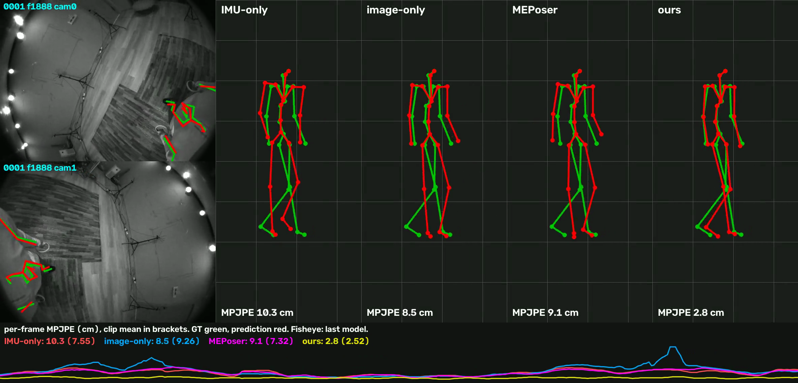

# MEPoser reproduction on the EMHI subset — technical report

Harry Zhang · September 2026 · code, configs and commands: [README](../README.md) · details: [appendix](REPORT_APPENDIX.md)

## 1. Task and approach

EMHI (Fan et al., AAAI 2025) estimates the SMPL pose and shape of a VR user from the headset's two downward fisheye
cameras and five tracked IMUs (headset, two controllers, two shank trackers). Its baseline **MEPoser** (Section 4,
Appendix B) encodes both fisheye views with a weight-shared RegNetY-400MF into 22-joint heatmaps and a local/global 3D
joint pathway, encodes the IMUs with an MLP, concatenates the features, runs three LSTM + feed-forward blocks and
regresses SMPL pose (6D) and shape with two MLP heads; the body is placed by the headset pose. Loss (Appendix B):
`1 heatmap + 1 local joints + 1 global joints + 5 SMPL + 0.5 smooth`.

We implemented this architecture and loss as described, adapted the training schedule to the 10-sequence subset and one
GPU, and then added what the paper leaves unused: the geometry of the calibrated stereo fisheye rig and the controllers.

## 2. Data, assumptions and protocol

- **Data.** 10 folders (`0000`-`0009`, called subjects in the release), each a ~2-minute recording at 30 fps (32 k
  annotated frames), ~1 % of the full dataset.
- **Data audit** ([DATA_AUDIT.md](results/DATA_AUDIT.md), `scripts/data_audit.py`; inventory, completeness,
  consistency, distributions per folder). Findings that change the interpretation:
  - *The 10 folders are probably one person.* Their SMPL shape parameters are identical to within 0.07 (L2 over 10
    betas) and the standing head height is 1.36-1.38 m in all of them. The data cannot tell one person from a shared
    template shape, so a held-out folder below is a held-out recording; cross-person generalisation is untested.
  - *0000 is fragmented.* 593 of its 1984 image pairs have no annotation, in regular gaps of 1-10 frames; the rest
    splits into 141 runs of median 8 frames. It yields 2 temporal training windows (others 715-884) and is evaluated
    on 114 short segments. The loader now prints a warning for this instead of dropping the frames silently.
  - *Motion is unbalanced.* Feet move (> 20 cm/s) in 58-72 % of frames in 0000-0002 and in 0 % in 0007-0009. All leg
    joints are visible in more than 98.8 % of frames of every folder, so leg occlusion is essentially absent; the
    occlusion that exists is arms leaving the view (32 % of 0007).
  - *Leg trackers slip.* The rotation between a shank tracker and the ground-truth shank should be constant; its
    median deviation is 2-6 deg in most folders but 13-16 deg in 0003 and 0006 (right).
  - Otherwise clean: no NaN, no frozen sensors or images, betas and bone lengths constant within a folder, headset and
    ground truth in sync (0 +- 1 frame), ground-truth 3D reprojects onto the given 2D joints at 1-2 px median. Isolated
    controller jumps of up to 41 cm (0004, 0007).
- **Recovered, not documented** (verified by `meposer inspect`, [INSPECTION.md](results/INSPECTION.md)): Kannala-Brandt
  fisheye intrinsics fitted from the annotations (1.5 px reprojection, FOV 157 x 116 deg); a rigid camera-to-headset
  transform (0.3 deg / 0.2 cm spread); quaternion order wxyz; world-frame, gravity-free accelerations; one dataset bug
  (`left_hand_acc` is a copy of `left_hand_pos`, excluded). The "IMU" inputs are tracked device outputs, not raw IMU.
- **Split.** Cross-validation by folder, 3 folds holding out 0000+0005, 0001+0006, 0002+0007; every fold retrains the
  image branch on its 8 training folders; no frame of a held-out folder is used for training, normalisation or model
  selection; last epoch of a fixed schedule.
- **Metrics** (paper's Table 2, code from HMD-Poser, which the paper compares against): MPJPE, PA-MPJPE, MPJRE, Upper/
  Lower/Hand PE, Jitter; 22 SMPL joints, predictions aligned to the ground-truth head joint, one causal pass per held-out
  sequence. The paper reports no world-frame error; with a SLAM-tracked headset the body is placed by the headset anyway.
- **Compute.** Apple M4 Max for development, one NVIDIA H200 for every reported number.

## 3. Training schedule adapted to the subset

| paper | here | reason |
|---|---|---|
| all modules trained jointly with one loss | image branch trained per frame first (heatmap + 3D losses), its outputs cached; fusion + LSTM + heads trained on them (two-stage). Joint training reported alongside | a paper-size step is 32 windows x 32 frames x 2 views = 2048 images; two-stage gets 4x more optimizer updates in the same time |
| 640 x 480 | 320 x 240 (heatmap stride 8 kept) | 4x throughput |
| Adam, 20 epochs, batch 32 windows, lr 1e-3, x0.1 at 7 / 14 | identical for the temporal model; image branch 10 epochs | image branch converges by epoch 8 on 25 k frames |

*Stage-2 validation curves (development split). The image-only variant does not train at lr 1e-3 (flat until the
second decay) and needs 1e-4; the paper's lr is right for the fused and IMU-only models.*

## 4. Reproduction results

3-fold CV, 6 held-out folders; columns as in the paper's Table 2 plus hand error and foot skating
([all rows](results/metrics_full.md)). MPJRE in degrees, PE in cm, FS in cm/s on frames where the ground-truth foot is
planted (our metric; ground truth itself 7.2). The paper's numbers are on the full dataset and are not directly comparable.

| model | MPJRE | MPJPE | PA | Upper | Lower | Root | Jitter | Hand | FS |
|---|---|---|---|---|---|---|---|---|---|
| MEPoser-IMU, reproduced | 3.93 | 4.21 | 3.20 | 3.29 | 5.53 | 3.09 | 235 | 7.41 | 23.9 |
| MEPoser-CV, reproduced | 4.78 | 4.02 | 2.88 | 3.46 | 4.84 | 2.25 | 328 | 8.85 | 30.3 |
| **MEPoser-Full, reproduced (two-stage)** | 3.83 | **3.53** | 2.89 | 2.99 | 4.30 | 2.19 | 247 | 7.24 | 23.7 |
| MEPoser-Full, joint training (effective batch 32) | 4.49 | 4.26 | 3.71 | 3.65 | 5.14 | 2.35 | 249 | 9.22 | 23.5 |
| ours, 20 epochs, without the leg crop | 3.75 | 2.46 | 2.00 | 1.60 | 3.69 | 1.87 | 104 | 2.14 | 23.2 |
| **ours**, 40 epochs + leg crop | 3.56 | **1.96** | 1.54 | 1.56 | 2.53 | 1.71 | 93 | 2.16 | 17.7 |
| ours, 40 epochs + leg crop + contact fit | 3.62 | 1.99 | 1.58 | 1.56 | 2.61 | 1.71 | 110 | 2.16 | 10.2 |
| *paper P1: MEPoser-IMU / CV / Full* | *5.0 / 5.4 / 4.1* | *6.2 / 4.5 / 3.7* | *3.6 / 2.9 / 2.5* | *5.0 / 3.3 / 2.7* | *8.0 / 6.3 / 5.1* | *5.2 / 3.8 / 3.2* | *122 / 511 / 162* | *n/r* | *n/r* |
| *paper P2: MEPoser-IMU / CV / Full* | *5.7 / 6.0 / 4.7* | *7.1 / 5.4 / 4.8* | *4.2 / 3.5 / 2.9* | *5.4 / 3.8 / 3.2* | *9.9 / 7.8 / 7.0* | *6.6 / 4.4 / 3.8* | *162 / 567 / 205* | *n/r* | *n/r* |

P1: unseen subjects, seen actions; P2: unseen subjects and actions (in the paper, with many distinct people); n/r: not reported. The paper gives no Jitter unit;
ours uses HMD-Poser's code (ground truth 62).

**The paper's claim reproduces:** fusion beats both single modalities on average and on 5 of 6 held-out folders, and the
modalities are complementary as expected (images help the visible lower body, IMUs help hands and rotations). Absolute
numbers are not comparable with the paper's (1 % of the data, probably one person).

## 5. Improvements and what each one solves

Each row adds one change (20-epoch model); fold holding out 0001 and 0006, MPJPE / legs / arms in cm
([hard_cases.md](results/hard_cases.md)).

| variant | all frames | | | fast motion (top 25 %) | | |
|---|---|---|---|---|---|---|
| | MPJPE | legs | arms | MPJPE | legs | arms |
| MEPoser (reproduced) | 5.46 | 8.92 | 9.69 | 6.84 | 11.07 | 12.14 |
| + world-yaw / IMU augmentation + foot-contact head | 4.65 | 8.76 | 6.87 | 4.60 | 9.85 | 5.05 |
| + controller-driven wrist IK | 3.83 | 8.76 | 2.53 | 4.10 | 9.85 | 2.36 |
| + stereo 2D reprojection fit | 3.11 | 6.22 | 2.40 | 3.44 | 7.53 | 2.25 |
| + adaptive lower-body crop | 2.58 | 4.21 | 2.45 | 2.84 | 5.28 | 2.30 |
| + 4 Hz zero-phase low-pass (final) | **2.50** | **4.01** | **2.38** | **2.73** | **4.94** | **2.24** |

Two further steps, measured on all three folds:

| 3 folds | MPJPE | Lower | FS | Jitter |
|---|---|---|---|---|
| 20-epoch model, IK + 2D fit + low-pass (current code) | 2.42 | 3.61 | 23.1 | 105 |
| + leg crop (leg network 8 / 16 epochs) | 2.05 / 2.04 | 2.68 | 18.7 | 97 |
| 40-epoch model, network output | 2.99 | 3.81 | 21.4 | 233 |
| + IK + 2D fit + low-pass | 2.31 | 3.41 | 22.7 | 102 |
| + leg crop (16 epochs) | **1.96** | 2.53 | 17.7 | 93 |
| + contact fit | 1.99 | 2.61 | 10.2 | 110 |

Training the temporal model twice as long (40 epochs, decays moved to 14 / 28) improves every held-out folder; training
the leg network twice as long changes nothing (0.01 cm). The contact fit was configured on one exploratory fold (0001,
0006) and applied unchanged to all three: it cuts foot skating by 43 % but raises MPJPE by 0.03 cm. It helps the fold it
was tuned on (0001: 2.40 → 2.29) and hurts the others (0005: 1.66 → 1.87), so we keep it optional.

- **Augmentation + contact head → generalisation to held-out recordings.** Training error is 0.8 cm, held-out 3-6 cm;
  rotating the world about the vertical per window, sensor noise and a contact head trained on SMPL sole-vertex pseudo
  labels remove shortcuts the 8 training recordings allow. Largest effect on fast motion (arms 12.1 → 5.1 cm).
- **Wrist IK → hands.** The controller-to-wrist offset is rigid (one offset from training recordings predicts the wrist
  to 1.8-2.0 cm); optimising collar/shoulder/elbow rotations so the FK wrist meets it cuts arm error to 2.4 cm.
- **Stereo 2D fit → visible limbs.** On held-out recordings the 2D heatmap peaks stay accurate (~10 px) while the learned 3D
  lift degrades 2-3x; fitting limb rotations so FK joints reproject onto confident peaks in both views (through the
  calibrated fisheye, headset-derived camera pose, no ground truth) restores the visible evidence: legs 8.8 → 6.2 cm.
- **Adaptive lower-body crop → leg precision.** 40 x 30 heatmaps quantise to 16 px, which caps the fit. Legs are
  cropped from the native 640 x 480 images around the model's own projected leg prediction and a leg network (backbone
  reused from the image branch) localises them at 4 px median instead of 10: legs 6.2 → 4.2 cm.
- **Low-pass → jitter.** The LSTM output jitters at ~4x the annotation; a fixed filter brings it to 1.5x (offline).
- **Contact fit → foot skating.** Per-frame fitting moves planted feet. A fit of the leg rotations over the whole
  segment keeps a foot still while the contact head is confident (p > 0.9), with an acceleration prior: foot skating
  17.7 → 10.2 cm/s, MPJPE 1.96 → 1.99 cm, jitter 93 → 110. The floor height is known (a VR runtime provides it) and constant, but a floor term was unstable
  and is not used: the predicted lowest foot is already within 0.5-3 cm of the floor.

*Held-out 0006, fast whole-body motion. Left: our predicted SMPL mesh (orange) and joints (red) projected into both
headset fisheye views, ground-truth joints green. Right: ground-truth mesh, MEPoser's prediction and ours. Animated:
[mesh_0006.gif](figures/clips/mesh_0006.gif); five more clips (walking, arms out of view, partial leg occlusion) in the
[README](../README.md#visualization).*

*The held-out stretch where MEPoser errs most (0001, walking): IMU-only 7.55, image-only 9.26, MEPoser 7.32, ours
2.52 cm over the clip. Animated: [compare_0001_hard.gif](figures/compare_0001_hard.gif).*

## 6. Insights

- **Fusion without geometry.** MEPoser concatenates features and lets an LSTM sort it out. It uses neither the stereo
  geometry (3D comes from an MLP on heatmaps) nor the controllers as constraints, although the controllers pin the wrists
  to 2 cm. Our largest gains come exactly from putting these two back.
- **2D generalises, the learned lift does not.** The network's 2D evidence is nearly as good on held-out recordings as
  on training ones; its depth reasoning is not. Geometry fixes what data volume cannot.
- **The stereo rig does not measure depth at body distance.** The cameras are 11 cm apart and the feet 1.3-1.4 m away
  (rays 4.5 deg apart), so 1 px of 2D error is ~6 cm of depth. Triangulating the leg-crop peaks gives 10-11 cm 3D error
  where the pipeline has 2.3-2.7 cm, with identical lateral error: depth comes from the headset anchor and bone lengths,
  and the reprojection fit already uses all the 2D information. Learned or explicit triangulation is therefore not a
  promising direction for this rig.
- **Generalisation, not capacity, is the bottleneck.** One LSTM block is as good as three; wider encoders diverge.
- **The validation recordings decide the ranking.** On a fixed split with the two static recordings (0008, 0009: feet
  never move) the fused model looked much better than under cross-validation; all headline numbers are cross-validated.
- **Failure mode.** On the rare frames where the legs are not visible (28 of 6987) our pipeline is worse than MEPoser
  (legs 4.3 → 15.4 cm): augmentation already costs 3.9 cm there, the 2D fit and leg crop another 11 cm by fitting
  spurious peaks. The fit should be gated by visibility, not only by heatmap confidence.
- **Per-frame fitting makes feet slide.** Foot skating is 7.2 cm/s in the ground truth, 17.0 after IK + low-pass and
  23.2 after the per-frame 2D fit; the contact fit over time removes most of it at a small cost in MPJPE and jitter,
  as reported for WHAM's contact refiner. Tuned on one fold it looked free (2.50 → 2.43); on all three it is not.

## 7. Reproduction challenges

- No camera model, quaternion convention, window length or shape supervision in the paper; recovered from the data or
  chosen and documented (appendix, Section B).
- Joint training under-fits with our first configuration (8 windows per step at the paper's lr, half the data per epoch:
  5.76 cm); with the paper's effective batch it reaches 4.26 cm, and the remaining gap is consistent with 4x fewer
  optimizer updates in our time budget. We did not run the matched-update joint schedule (~3 h per fold).
- A half-cell offset (8 px) in converting heatmap peaks to pixels silently biased the 2D fit until the visualisations
  showed that visible joints were not aligned. The cross-validation rows with the 2D fit predate the fix; the current code
  is about 0.05 cm better on them.
- The first dataset inspection listed 0000's 141 segments but did not flag them, and the loader dropped the short runs
  silently; the full audit above was added afterwards.
- Backend issues on Apple MPS (a non-deterministic NaN, a wrong broadcasting matmul in eval mode); every number was
  re-run on CUDA.

## 8. Concrete next steps

1. Evaluate on distinct people: with one body shape in the subset, cross-person generalisation is the open question.
2. Move the wrist, reprojection and contact terms from test time into training so the network uses them; gate the 2D
   terms by predicted visibility; merge the contact fit into the 2D fit instead of running it afterwards.
3. Contact detection fused from the shank-tracker accelerations and the contact head, to avoid locking a moving foot.
4. Joint training with matched updates (gradient accumulation to 32 windows, 3.7 k steps) and a causal output filter.

## Deliverables and AI use

Code, configs and exact commands: [README](../README.md). Best checkpoint (40 epochs, fold holding out 0001+0006) and the
leg-crop network: `checkpoints/`. Every number above: `reports/results/`. The dataset is not redistributed; the figures show a few
processed frames for illustration. Thanks to Claude Code (Anthropic) for taking part in the
implementation, the experiments and the drafting of this report.
