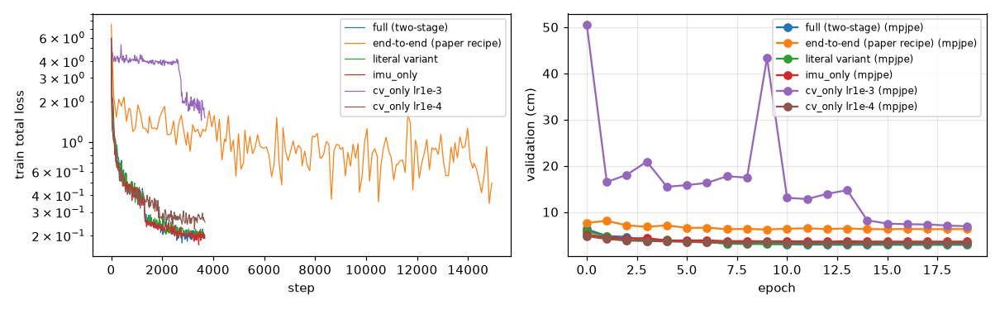
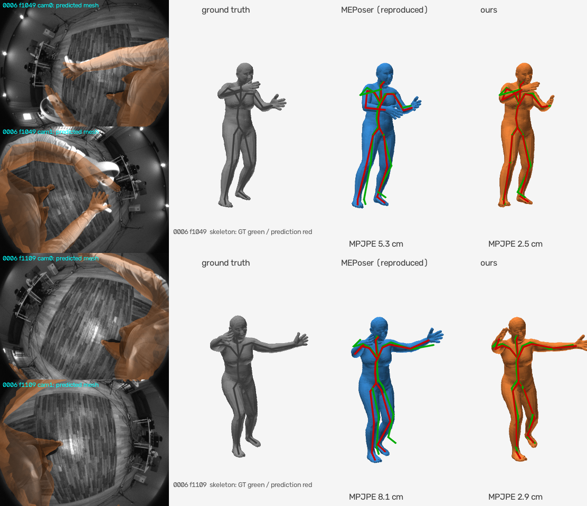
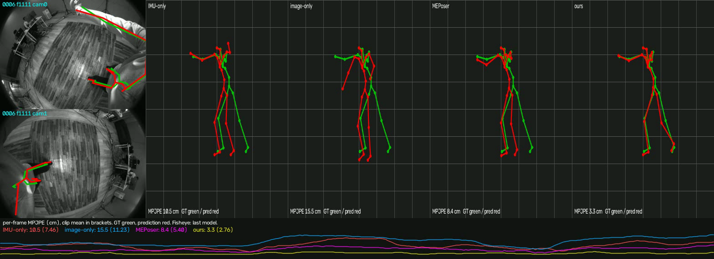

# MEPoser reproduction on the EMHI subset — technical report

Harry Zhang · September 2026 · code, configs and commands: [README](../README.md) · details: [appendix](REPORT_APPENDIX.md)

## 1. Task and approach

EMHI (Fan et al., AAAI 2025) estimates the SMPL pose and shape of a VR user from the headset's two downward fisheye
cameras and five tracked IMUs (headset, two controllers, two shank trackers). Its baseline **MEPoser** (Section 4,
Appendix B) encodes both fisheye views with a weight-shared RegNetY-400MF into 22-joint heatmaps and a local/global 3D
joint pathway, encodes the IMUs with an MLP, concatenates the features, runs three LSTM + feed-forward blocks and
regresses SMPL pose (6D) and shape with two MLP heads; the body is placed by the headset pose. Loss (Appendix B):
`1 heatmap + 1 local joints + 1 global joints + 5 SMPL + 0.5 smooth`.

We implemented this architecture and loss as described, adapted the training schedule to the 10-subject subset and one
GPU, and then added what the paper leaves unused: the geometry of the calibrated stereo fisheye rig and the controllers.

## 2. Data, assumptions and protocol

- **Data.** 10 subjects = 10 continuous ~2-minute recordings at 30 fps (32 k frames), ~1 % of the full dataset.
- **Recovered, not documented** (verified by `meposer inspect`, [INSPECTION.md](results/INSPECTION.md)): Kannala-Brandt
  fisheye intrinsics fitted from the annotations (1.5 px reprojection, FOV 157 x 116 deg); a rigid camera-to-headset
  transform (0.3 deg / 0.2 cm spread); quaternion order wxyz; world-frame, gravity-free accelerations; one dataset bug
  (`left_hand_acc` is a copy of `left_hand_pos`, excluded). The "IMU" inputs are tracked device outputs, not raw IMU.
- **Split.** Subject-level cross-validation, 3 folds holding out 0000+0005, 0001+0006, 0002+0007 (6 held-out
  subjects); every fold retrains the image branch on its 8 training subjects; no frame of a held-out subject is used for
  training, normalisation or model selection; last epoch of a fixed schedule.
- **Metrics** (paper's Table 2, code from HMD-Poser, which the paper compares against): MPJPE, PA-MPJPE, MPJRE, Upper/
  Lower/Hand PE, Jitter; 22 SMPL joints, predictions aligned to the ground-truth head joint, one causal pass per held-out
  sequence. The paper reports no world-frame error; with a SLAM-tracked headset the body is placed by the headset anyway.
- **Compute.** Apple M4 Max for development, one NVIDIA H200 for every reported number.

## 3. Training schedule adapted to the subset

| paper | here | reason |
|---|---|---|
| all modules trained jointly with one loss | image branch trained per frame first (heatmap + 3D losses), its outputs cached; fusion + LSTM + heads trained on them (two-stage). Joint training reported alongside | a paper-size step is 32 windows x 32 frames x 2 views = 2048 images; two-stage gets 4x more optimizer updates in the same time |
| 640 x 480 | 320 x 240 (heatmap stride 8 kept) | 4x throughput |
| Adam, 20 epochs, batch 32 windows, lr 1e-3, x0.1 at 7 / 14 | identical for the temporal model; image branch 10 epochs | image branch converges by epoch 8 on 25 k frames |

*Stage-2 validation curves (development split). The image-only variant does not train at lr 1e-3 (flat until the
second decay) and needs 1e-4; the paper's lr is right for the fused and IMU-only models.*

## 4. Reproduction results

3-fold CV, 6 held-out subjects, MPJPE in cm ([full table](results/final_table.md)).

| model | mean | PA | MPJRE deg | HandPE | LowerPE | Jitter (GT 62) |
|---|---|---|---|---|---|---|
| IMU only | 4.21 | 3.20 | 3.93 | 7.41 | 5.53 | 235 |
| image only | 4.02 | 2.88 | 4.78 | 8.85 | 4.84 | 328 |
| **MEPoser, reproduced (two-stage)** | **3.53** | 2.89 | 3.83 | 7.24 | 4.30 | 247 |
| MEPoser, joint training (effective batch 32 windows) | 4.26 | 3.71 | 4.49 | 9.22 | 5.14 | 249 |
| *paper, full data, Protocol 1: IMU / CV / Full* | *6.2 / 4.5 / 3.7* | | | | | |

**The paper's claim reproduces:** fusion beats both single modalities on average and on 5 of 6 subjects, and the
modalities are complementary as expected (images help the visible lower body, IMUs help hands and rotations). Absolute
numbers are not comparable with the paper's (different subjects and actions, 1 % of the data).

## 5. Improvements and what each one solves

Each row adds one change; fold holding out the two most active subjects (0001, 0006), MPJPE / legs / arms in cm
([hard_cases.md](results/hard_cases.md)).

| variant | all frames | | | fast motion (top 25 %) | | |
|---|---|---|---|---|---|---|
| | MPJPE | legs | arms | MPJPE | legs | arms |
| MEPoser (reproduced) | 5.46 | 8.92 | 9.69 | 6.84 | 11.07 | 12.14 |
| + world-yaw / IMU augmentation + foot-contact head | 4.65 | 8.76 | 6.87 | 4.60 | 9.85 | 5.05 |
| + controller-driven wrist IK | 3.83 | 8.76 | 2.53 | 4.10 | 9.85 | 2.36 |
| + stereo 2D reprojection fit | 3.11 | 6.22 | 2.40 | 3.44 | 7.53 | 2.25 |
| + adaptive lower-body crop | 2.58 | 4.21 | 2.45 | 2.84 | 5.28 | 2.30 |
| + 4 Hz zero-phase low-pass (final) | **2.50** | **4.01** | **2.38** | **2.73** | **4.94** | **2.24** |

Over all three folds the same pipeline without the leg crop gives **2.46 cm** (vs 3.53), hands 2.14 cm (vs 7.24).

- **Augmentation + contact head → cross-subject generalisation.** Training error is 0.8 cm, held-out 3-6 cm; rotating
  the world about the vertical per window, sensor noise and a contact head trained on SMPL sole-vertex pseudo labels
  remove shortcuts the 8 training subjects allow. Largest effect on fast motion (arms 12.1 → 5.1 cm).
- **Wrist IK → hands.** The controller-to-wrist offset is rigid (one offset from training subjects predicts the wrist
  to 1.8-2.0 cm); optimising collar/shoulder/elbow rotations so the FK wrist meets it cuts arm error to 2.4 cm.
- **Stereo 2D fit → visible limbs.** On unseen people the 2D heatmap peaks stay accurate (~10 px) while the learned 3D
  lift degrades 2-3x; fitting limb rotations so FK joints reproject onto confident peaks in both views (through the
  calibrated fisheye, headset-derived camera pose, no ground truth) restores the visible evidence: legs 8.8 → 6.2 cm.
- **Adaptive lower-body crop → leg precision.** 40 x 30 heatmaps quantise to 16 px, which caps the fit. Legs are
  cropped from the native 640 x 480 images around the model's own projected leg prediction and a leg network (backbone
  reused from the image branch) localises them at 4 px median instead of 10: legs 6.2 → 4.2 cm.
- **Low-pass → jitter.** The LSTM output jitters at ~4x the annotation; a fixed filter brings it to 1.5x (offline).

*Hard clip of held-out subject 0006 (fast whole-body motion). Left: our predicted mesh projected into both headset
fisheye views. Right: ground truth, reproduced MEPoser and ours; skeletons: ground truth green, prediction red.
Animated: [mesh_0006.gif](figures/mesh_0006.gif).*

*Same clip, all four models against ground truth, with the per-frame error below. Animated:
[compare_0006.gif](figures/compare_0006.gif).*

## 6. Insights

- **Fusion without geometry.** MEPoser concatenates features and lets an LSTM sort it out. It uses neither the stereo
  geometry (3D comes from an MLP on heatmaps) nor the controllers as constraints, although the controllers pin the wrists
  to 2 cm. Our largest gains come exactly from putting these two back.
- **2D generalises, the learned lift does not.** With 8 training subjects the network's 2D evidence is nearly as good on
  new people as on seen ones; its depth reasoning is not. Geometry fixes what data volume cannot.
- **Generalisation, not capacity, is the bottleneck.** One LSTM block is as good as three; wider encoders diverge.
- **The validation subjects decide the ranking.** On a fixed split with two static subjects the fused model looked much
  better than under cross-validation; all headline numbers are therefore cross-validated.
- **Failure mode.** On the rare frames where the legs are not visible (28 of 6987) our pipeline is worse than MEPoser
  (legs 4.3 → 15.4 cm): augmentation already costs 3.9 cm there, the 2D fit and leg crop another 11 cm by fitting
  spurious peaks. The fit should be gated by visibility, not only by heatmap confidence.

## 7. Reproduction challenges

- No camera model, quaternion convention, window length or shape supervision in the paper; recovered from the data or
  chosen and documented (appendix, Section B).
- Joint training under-fits with our first configuration (8 windows per step at the paper's lr, half the data per epoch:
  5.76 cm); with the paper's effective batch it reaches 4.26 cm, and the remaining gap is consistent with 4x fewer
  optimizer updates in our time budget. We did not run the matched-update joint schedule (~3 h per fold).
- A half-cell offset (8 px) in converting heatmap peaks to pixels silently biased the 2D fit until the visualisations
  showed that visible joints were not aligned. The cross-validation rows with the 2D fit predate the fix; the current code
  is about 0.05 cm better on them.
- Backend issues on Apple MPS (a non-deterministic NaN, a wrong broadcasting matmul in eval mode); every number was
  re-run on CUDA.

## 8. Concrete next steps

1. Move the wrist and reprojection terms from test time into the training loss so the network, not an optimiser, uses
   them; gate the 2D terms by predicted visibility.
2. Explicit ray triangulation of the two views and sub-pixel leg crops for all folds (the crop was trained for one fold).
3. Joint training with matched updates (gradient accumulation to 32 windows, 3.7 k steps) and a causal output filter.
4. Body shape from tracker geometry (headset height, controller span) instead of image regression.

## Deliverables and AI use

Code, configs and exact commands: [README](../README.md). Best checkpoint (fold holding out 0001+0006) and the leg-crop
network: `checkpoints/`. Every number above: `reports/results/`. The dataset is not redistributed; the figures show a few
processed frames for illustration. AI use: I am responsible for the design decisions, checks and conclusions; Claude Code (Anthropic) was used for
implementation, running experiments and drafting.
